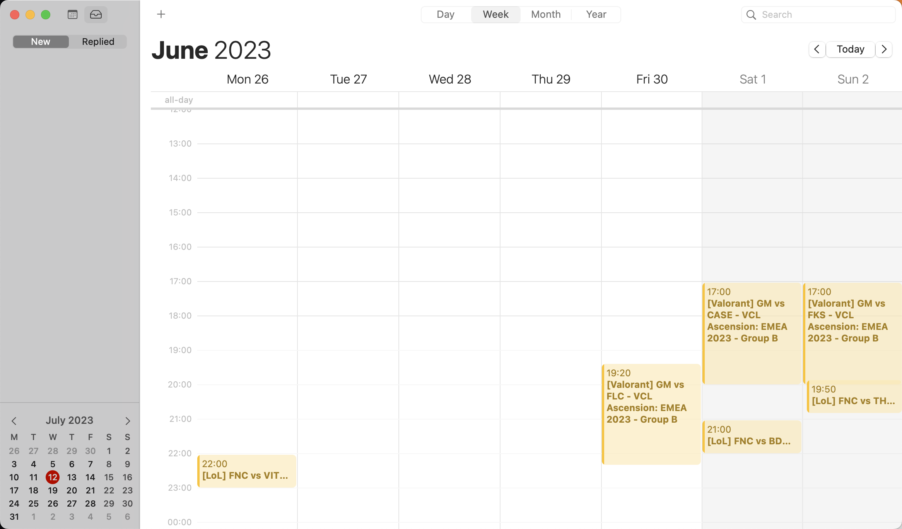

# Esports Calendar

Subscribe to your favorite esports teams directly in your calendar



## Usage

Using your calendar client, subscribe to:

```
https://errorna.me/tools/esports-calendar/calendar.ics?teams=fnatic,fnatic-valorant,gentle-mates,g2-gozen,karmine-corp-female
```

> Note: You can subscribe to any team you want!

**Apple Calendar**:

- Click on "File" > "New calendar subscription"
- Paste the URL here

**Google Calendar**:

- Next to "Other calendars", click on the "+" icon, then "From URL"
- Paste the URL here

### How to find a team's slug?

Go to https://pandascore-graphql.web.app/

Use the following query:

```graphql
query {
  teams(search: { name: "karmine" }) {
    id
    slug
    acronym
    name
  }
}
```
